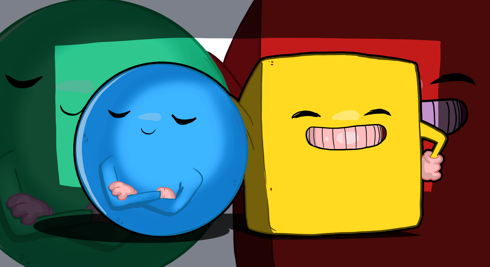

# Roll a Ball -- Unity
###### Anxo Fernández Rodríguez

---

>[!IMPORTANT]
> - `Script` de movimiento de la esfera: `[PlayerController.cs](Assets/Scripts/CameraController.cs)
> - `Script` de movimiento de la cámara: [CameraController.cs](Assets/Scripts/CameraController.cs)
> - `Script` para cambiar entre cámaras: [CameraSwitcher.cs](Assets/Scripts/CameraSwitcher.cs)
> - `Script` para la primera persona de la cámara: [FirstPersonController.cs](Assets/Scripts/FirstPersonController.cs)

## Descripción
Este proyecto es un juego de habilidad en el que el jugador controla una esfera que debe recoger objetos en un escenario 3D. El objetivo es recoger todos los objetos posibles en el menor tiempo posible. El juego cuenta con un contador de tiempo y un contador de objetos recogidos.

## Controles
- **W, A, S, D**: Mover la esfera.

## Objetos
- **Cubos**: Suma 1 al contador de objetos recogidos.

## Escenario
El escenario es un plano con cubos distribuidos aleatoriamente. Ademas cuenta con obstáculos que el jugador debe evitar si no quiere perder tiempo.
- **Contador de objetos recogidos**: Muestra el número de objetos recogidos.
- **Mensaje de victoria**: Aparece cuando se recogen todos los objetos.

## Scripts
- **PlayerController**: Controla el movimiento de la esfera.
- **CameraController**: Controla la posición de la cámara.
- **Rotator**: Hace que los objetos roten.

  

